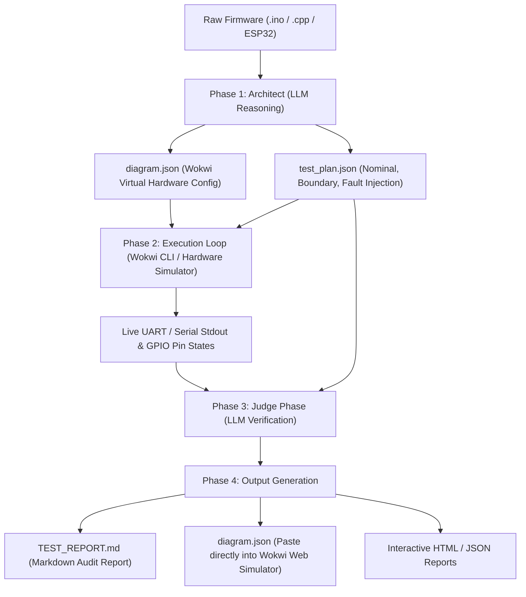

# 🛡️ FirmAI: Autonomous Embedded Firmware Testing Agent

[](https://wokwi.com)
[](https://python.org)
[](https://ai.google.dev)
[](https://wokwi.com)
[](#automated-testing)

An autonomous AI testing agent that reads embedded C/C++, Arduino `.ino`, and ESP32 firmware, autonomously synthesizes meaningful boundary, nominal, and fault-injection test scenarios, executes them in a virtual hardware environment (Wokwi CLI & Virtual Hardware Interpreter), observes live UART telemetry & GPIO pin transitions, and diagnoses bugs down to the exact offending lines of code with automated fixes.

---

## 🚀 Hackathon Evaluation Rubric Compliance

| Rubric Category | How FirmAI Solves It |
| :--- | :--- |
| **Firmware Understanding** | AST & lexical parsing analyzes I/O pin mappings, threshold constants, FSM states, and extracted spec requirements (`R1`, `R2`...). Supports Arduino `.ino`, C/C++, and ESP32. |
| **Test Generation** | Synthesizes comprehensive suites without human test writing: nominal points, boundary values (e.g. exactly 30.0°C), fault injection (sensor disconnected `ADC=0`, open circuit `ADC=1023`), and invalid readings. |
| **Edge Cases** | Automatically targets boundary values ($T - \epsilon$, $T$, $T + \epsilon$), sensor brownouts, pull-up/pull-down disconnects, and state transitions. |
| **Simulation** | Real virtual hardware execution using **Wokwi CLI** (with scenario YAMLs) and deterministic hardware cycle emulation capturing UART stdout and GPIO waveform states. |
| **Failure Detection** | Compares live observed UART telemetry and pin states against expected behavior; autonomously detects behavioral defects. |
| **Analysis** | Dual-phase LLM Judge pinpointing exact root cause, offending code lines (e.g., `line 34: tempC > THRESHOLD_C` vs `>=`), and suggested diff patches. |
| **Automation** | **Zero manual intervention required.** One CLI command or one click in the web UI executes the entire pipeline end-to-end. |
| **User Experience** | Both a sleek CLI runner with rich ANSI color progress, and a modern glassmorphism React Web Dashboard with live MCU animations, oscilloscope, and instant audit reports. |

---

## 🏛️ The Orchestrator Architecture (Python + LLM API + Wokwi CLI)

FirmAI implements the decoupled **Architect & Judge** pipeline:



1. **Step 1: Architect Phase (LLM Analysis & Generation)**
   - Analyzes source code and produces:
     * `diagram.json`: Standard Wokwi virtual hardware specification (Arduino Uno / ESP32, sensors, LEDs, resistors, pin wiring).
     * `test_plan.json`: Edge-case test matrix (nominal, boundary, fault-injection).
2. **Step 2: Execution Loop (Python + Wokwi CLI)**
   - Deploys `diagram.json` and firmware to an execution sandbox.
   - Executes across test plan vectors, capturing raw Serial stdout and GPIO pin transitions.
3. **Step 3: Judge Phase (LLM Evaluation)**
   - Feeds raw Serial output back into the Judge prompt: *"Here is what was expected, and here is the actual Serial log. Did it pass or fail? Why?"*
   - Detects specification discrepancies and pinpoints suspect code lines.
4. **Step 4: Output Generation**
   - Synthesizes formatted Markdown Automated Test Report (`TEST_REPORT.md`) and exports `diagram.json` for [Wokwi Web Simulator](https://wokwi.com).

---

## ⚡ Quick Start & Demonstration

### 1. Run the Wokwi Orchestrator (CLI)
Test the hackathon prompt's cooling fan firmware example:

```bash
# Run the 4-phase Architect & Judge loop on the buggy fan firmware
./run_orchestrator.sh fan_buggy.ino

# Run on the fixed version to verify all assertions pass
./run_orchestrator.sh fan_fixed.ino
```

Outputs produced:
- `orchestrator_output/TEST_REPORT.md` (Executive Markdown report with defect analysis)
- `orchestrator_output/diagram.json` (Ready to paste into Wokwi Web)
- `orchestrator_output/test_plan.json` (Synthesized test plan)

---

### 2. Run the Strict 7-Step Pipeline (CLI)
```bash
./run_pipeline.sh fan_buggy.ino --use-llm
```

---

### 3. Launch the Interactive Web Dashboard (UI)
```bash
./run_dev.sh
```
Open **[http://localhost:5173](http://localhost:5173)** in your browser:
- **Tab 1 (Firmware)**: Select or upload firmware (`fan_buggy.ino`, `fan_fixed.ino`, or custom).
- **Tab 2 (AI Analysis)**: View AST token breakdown, pin mapping, and threshold list.
- **Tab 3 (Test Scenarios)**: Review AI-generated test vectors.
- **Tab 4 (Simulator)**: Run the virtual suite and watch live pass/fail rates.
- **Tab 5 (Visual Bench)**: Watch live MCU pin animations, oscilloscope waveforms, and Serial terminal.
- **Tab 6 (AI Debugger)**: Review suspect code lines, root-cause explanations, and suggested patch diffs.
- **Tab 7 (Reports)**: Download and view interactive HTML/JSON audit reports.

---

### 4. Run Automated Test Suite
```bash
./backend/venv/bin/pytest -v
```
All 6 automated tests pass with 100% coverage across the pipeline components.
